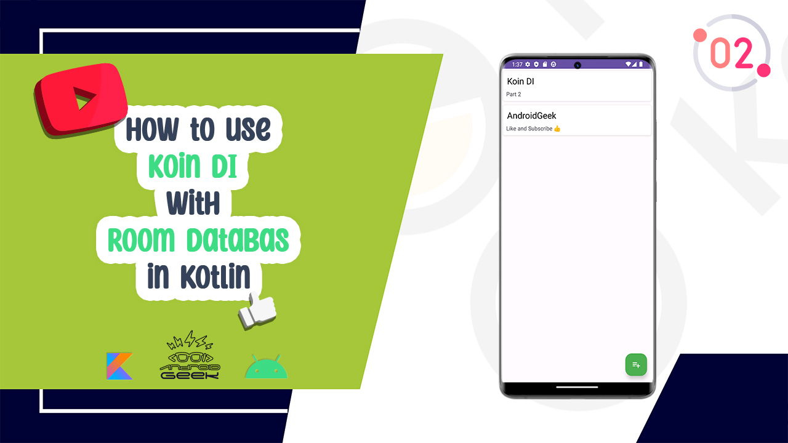

# KoinDI_RoomDatabase-Youtube

</a>

 
YouTube Video 
  
Part1:
 

 
Part2:
 

  
  
Article on Medium:
 
Part 1:
 
https://androidgeek.co/part1-how-to-use-koin-di-with-room-database-in-kotlin-436023ac5572
 
Part 2 :
 
https://androidgeek.co/part2-how-to-use-koin-di-with-room-database-in-kotlin-3a9f69a58c6a
 
 
✨ Join Medium to read thousands of valuable stories ✨
 
https://medium.com/@ezatpanah/membership
